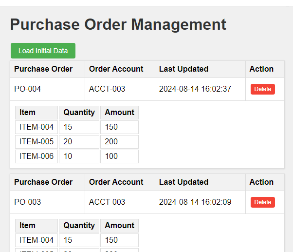

# Purchase Order Management Application

## Purpose
This Purchase Order Management application is designed for testing integration with Dynamics 365 Finance and Operations (D365FO). It provides a simple interface for creating, viewing, and managing purchase orders.



## Features
- Create new purchase orders with multiple line items
- View existing purchase orders
- Delete purchase orders
- Filter purchase orders by last update time
- Automatically update timestamps for each modification

## API Endpoints

### Create a Purchase Order
**Endpoint:** `{{APP_SITE_NAME}}/api/purchaseorder`
**Method:** POST
**Example Request Body:**
```json
{
  "purchId": "PO-004",
  "orderAccount": "ACCT-003",
  "lines": [
    {
      "purchId": "PO-003",
      "itemId": "ITEM-004",
      "quantity": 15,
      "lineAmount": 150
    },
    {
      "purchId": "PO-003",
      "itemId": "ITEM-005",
      "quantity": 20,
      "lineAmount": 200
    },
    {
      "purchId": "PO-003",
      "itemId": "ITEM-006",
      "quantity": 10,
      "lineAmount": 100
    }
  ]
}
```

### Get Purchase Orders
**Endpoint:** `{{APP_SITE_NAME}}/api/purchaseorder`
**Method:** GET
**Optional Query Parameter:** `updatedAt`
**Example Request:** `{{APP_SITE_NAME}}/api/purchaseorder?updatedAt=2024-08-13T13:47:18`

This request will return all purchase orders updated on or after the specified date and time.

## Setup and Installation
Open in Visual Studio 2022 and press Publish.. to Azure app service(Windows) 

## Technologies Used
- ASP.NET Core
- SQLite Database
- HTML/CSS/JavaScript for frontend
